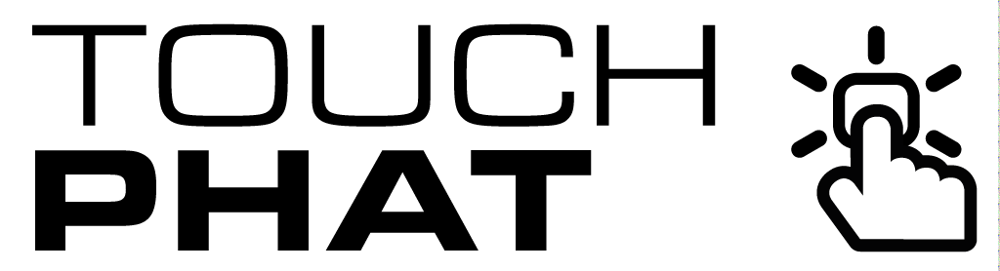

Touch pHAT is a simple add-on for your Pi or Pi Zero that includes 6 touch sensitive pads. Use it to add touch control to your projects.

## Installation

**Full install ( recommended ):**

We've created a super-easy installation script that will install all pre-requisites and get your Touch pHAT up and running in a jiffy. To run it fire up Terminal which you'll find in Menu -> Accessories -> Terminal on your Raspberry Pi desktop like so:


In the new terminal window type:

```bash
curl -sS https://get.pimoroni.com/touchphat | bash
```

If you choose to download examples you'll find them in `/home/pi/Pimoroni/touchphat`.
